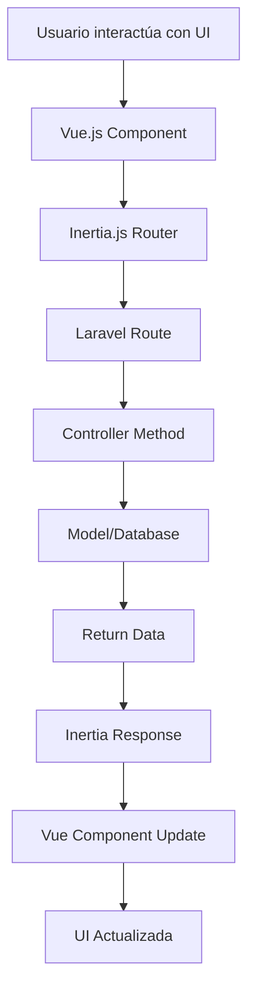

# 🏗️ Arquitectura del Sistema - Carrito Comida Rápida

## 📋 Índice
1. [Visión General](#-visión-general)
2. [Stack Tecnológico](#-stack-tecnológico)
3. [Arquitectura del Backend](#-arquitectura-del-backend)
4. [Arquitectura del Frontend](#-arquitectura-del-frontend)
5. [Patrones de Diseño](#-patrones-de-diseño)
6. [Estructura de Directorios](#-estructura-de-directorios)
7. [Flujo de Datos](#-flujo-de-datos)

---

## 🎯 Visión General

El sistema utiliza una **arquitectura monolítica moderna** basada en el patrón **MVC (Model-View-Controller)** con una capa de presentación **SPA (Single Page Application)** usando **Inertia.js** como puente entre Laravel y Vue.js.

### Características Arquitectónicas
- ✅ **Monolito Modular** - Fácil de desarrollar y desplegar
- ✅ **API-First** - Preparado para expansión móvil
- ✅ **Component-Based** - Interfaz reutilizable y mantenible
- ✅ **Real-time Updates** - Datos frescos sin recarga
- ✅ **Responsive Design** - Funciona en todos los dispositivos

---

## 🛠️ Stack Tecnológico

### Backend Stack
```
┌─────────────────┬──────────────────┬───────────────────┐
│   Framework     │    Versión       │    Propósito      │
├─────────────────┼──────────────────┼───────────────────┤
│ Laravel         │ 12.x            │ Framework Web PHP │
│ PHP             │ 8.1+            │ Lenguaje Backend  │
│ MariaDB/MySQL   │ 10.x/8.x       │ Base de Datos     │
│ Composer        │ 2.x             │ Gestor Dependencias│
└─────────────────┴──────────────────┴───────────────────┘
```

### Frontend Stack
```
┌─────────────────┬──────────────────┬───────────────────┐
│   Tecnología    │    Versión       │    Propósito      │
├─────────────────┼──────────────────┼───────────────────┤
│ Vue.js          │ 3.x             │ Framework JS      │
│ Inertia.js      │ 1.x             │ SPA sin API       │
│ Tailwind CSS    │ 3.x             │ Framework CSS     │
│ Vite            │ 4.x             │ Build Tool        │
│ NPM             │ 9.x             │ Gestor Paquetes   │
└─────────────────┴──────────────────┴───────────────────┘
```

### Librerías Especializadas
```
┌─────────────────┬──────────────────┬───────────────────┐
│   Librería      │    Propósito     │    Tipo           │
├─────────────────┼──────────────────┼───────────────────┤
│ DomPDF          │ Generación PDF   │ Backend           │
│ Carbon          │ Manejo Fechas    │ Backend           │
│ Eloquent ORM    │ Mapeo BD         │ Backend           │
│ Vue Router      │ Navegación SPA   │ Frontend          │
│ HeadlessUI      │ Componentes UI   │ Frontend          │
└─────────────────┴──────────────────┴───────────────────┘
```

---

## 🔧 Arquitectura del Backend

### Patrón MVC Extendido

```
┌─────────────────────────────────────────────────────────────┐
│                        BACKEND LAYERS                       │
├─────────────────┬───────────────────┬───────────────────────┤
│    LAYER        │    COMPONENTES    │       FUNCIÓN         │
├─────────────────┼───────────────────┼───────────────────────┤
│ Presentation    │ Controllers       │ Manejo de Requests    │
│                 │ Middleware        │ Autenticación/CORS    │
│                 │ Form Requests     │ Validaciones          │
├─────────────────┼───────────────────┼───────────────────────┤
│ Business Logic  │ Services          │ Lógica de Negocio     │
│                 │ Repositories      │ Abstracción de Datos  │
│                 │ Events/Listeners  │ Eventos del Sistema   │
├─────────────────┼───────────────────┼───────────────────────┤
│ Data Access     │ Models (Eloquent) │ Interacción con BD    │
│                 │ Migrations        │ Estructura de BD      │
│                 │ Seeders           │ Datos de Prueba       │
└─────────────────┴───────────────────┴───────────────────────┘
```

### Controladores por Módulo

```php
app/Http/Controllers/
├── TableroController.php     // Dashboard principal
├── ProductoController.php    // CRUD productos
├── PedidoController.php      // Gestión pedidos
├── ClienteController.php     // Gestión clientes  
├── ProveedorController.php   // Gestión proveedores
├── ReporteController.php     // Reportes y análisis
└── TicketController.php      // Generación PDFs
```

### Modelos Eloquent

```php
app/Models/
├── Producto.php      // Catálogo de productos
├── Cliente.php       // Base datos clientes
├── Proveedor.php     // Proveedores 
├── Pedido.php        // Órdenes principales
└── DetallePedido.php // Líneas de pedido
```

#### Relaciones Eloquent
```php
// Pedido.php
class Pedido extends Model {
    public function cliente() {
        return $this->belongsTo(Cliente::class, 'id_cliente');
    }
    
    public function detallePedidos() {
        return $this->hasMany(DetallePedido::class, 'id_pedido');
    }
}

// DetallePedido.php  
class DetallePedido extends Model {
    public function pedido() {
        return $this->belongsTo(Pedido::class, 'id_pedido');
    }
    
    public function producto() {
        return $this->belongsTo(Producto::class, 'id_producto');
    }
}
```

---

## 🎨 Arquitectura del Frontend

### Arquitectura Basada en Componentes

```
┌─────────────────────────────────────────────────────────────┐
│                      FRONTEND LAYERS                        │
├─────────────────┬───────────────────┬───────────────────────┤
│    LAYER        │    COMPONENTES    │       FUNCIÓN         │
├─────────────────┼───────────────────┼───────────────────────┤
│ Pages           │ Vue Pages         │ Rutas principales     │
│                 │ Inertia Router    │ Navegación SPA        │
├─────────────────┼───────────────────┼───────────────────────┤
│ Components      │ Reusable UI       │ Elementos reutilizables│
│                 │ Layout System     │ Estructura visual     │
│                 │ Form Components   │ Formularios           │
├─────────────────┼───────────────────┼───────────────────────┤
│ Styling         │ Tailwind CSS      │ Estilos utilitarios   │
│                 │ Custom CSS        │ Estilos específicos   │
│                 │ Responsive        │ Adaptación dispositivos│
└─────────────────┴───────────────────┴───────────────────────┘
```

### Estructura de Páginas Vue

```javascript
resources/js/pages/
├── Dashboard.vue             // Página principal
├── productos/
│   ├── Index.vue            // Lista productos
│   ├── Create.vue           // Crear producto
│   ├── Edit.vue             // Editar producto
│   └── Show.vue             // Ver producto
├── pedidos/
│   ├── Index.vue            // Lista pedidos
│   ├── Create.vue           // Crear pedido
│   └── Show.vue             // Ver pedido
├── clientes/
│   └── Index.vue            // Gestión clientes
├── proveedores/
│   └── Index.vue            // Gestión proveedores
└── reportes/
    └── Index.vue            // Dashboard reportes
```

### Componentes Reutilizables

```javascript
resources/js/components/
├── AppLayout.vue            // Layout principal
├── Navigation.vue           // Menú navegación
├── Footer.vue              // Pie de página
├── ui/
│   ├── DropdownMenu.vue    // Menús desplegables
│   ├── DropdownItem.vue    // Items de menú
│   ├── DropdownSeparator.vue // Separadores
│   ├── Button.vue          // Botones reutilizables
│   ├── Modal.vue           // Modales
│   └── Card.vue            // Tarjetas de contenido
└── forms/
    ├── FormInput.vue       // Inputs de formulario
    ├── FormSelect.vue      // Selects
    └── FormTextarea.vue    // Áreas de texto
```

---

## 🎯 Patrones de Diseño

### 1. Repository Pattern (Preparado)
```php
// Para futuras expansiones
interface ProductoRepositoryInterface {
    public function getActivos();
    public function getBajoStock();
    public function getPorCategoria($categoria);
}

class ProductoRepository implements ProductoRepositoryInterface {
    public function getActivos() {
        return Producto::where('activo', true)->get();
    }
}
```

### 2. Service Layer Pattern
```php
class PedidoService {
    public function crearPedido($datos) {
        // Lógica compleja de creación
        // Validaciones de negocio
        // Actualización de stock
        // Notificaciones
    }
    
    public function completarPedido($id) {
        // Cambio de estado
        // Actualización de inventario
        // Generación de tickets
    }
}
```

### 3. Observer Pattern (Events/Listeners)
```php
// Event
class PedidoCompletado {
    public $pedido;
    
    public function __construct(Pedido $pedido) {
        $this->pedido = $pedido;
    }
}

// Listener
class ActualizarInventario {
    public function handle(PedidoCompletado $event) {
        // Reducir stock de productos
    }
}
```

### 4. Factory Pattern (PDFs)
```php
class TicketFactory {
    public static function crear($tipo, $pedido) {
        switch($tipo) {
            case 'cliente':
                return new TicketCliente($pedido);
            case 'cocina':
                return new TicketCocina($pedido);
            case 'recibo':
                return new ReciboPago($pedido);
        }
    }
}
```

---

## 📁 Estructura de Directorios

### Estructura Completa del Proyecto

```
Leandro/
├── app/                          # Código de aplicación Laravel
│   ├── Http/
│   │   ├── Controllers/          # Controladores MVC
│   │   ├── Middleware/           # Middleware de aplicación
│   │   └── Requests/             # Form Requests para validación
│   ├── Models/                   # Modelos Eloquent
│   ├── Services/                 # Lógica de negocio
│   └── Providers/                # Service Providers
├── bootstrap/                    # Archivos de arranque Laravel
├── config/                       # Configuraciones de la aplicación
├── database/
│   ├── migrations/               # Migraciones de BD
│   ├── seeders/                  # Datos de prueba
│   └── factories/                # Factories para testing
├── docs/                         # 📚 DOCUMENTACIÓN
│   ├── README.md                 # Índice principal
│   ├── BASE_DE_DATOS.md         # Documentación BD
│   ├── ARQUITECTURA.md          # Este archivo
│   └── [otros archivos].md      # Más documentación
├── public/                       # Archivos públicos web
├── resources/
│   ├── js/                       # Código Vue.js/JavaScript
│   │   ├── components/           # Componentes reutilizables
│   │   ├── layouts/              # Layouts de página
│   │   ├── pages/                # Páginas Vue (rutas)
│   │   └── app.js                # Punto de entrada JS
│   ├── views/                    # Vistas Blade/PHP
│   │   ├── app.blade.php         # Template principal
│   │   └── pdf/                  # Plantillas PDF
│   └── css/                      # Estilos CSS/Tailwind
├── routes/
│   ├── web.php                   # Rutas web principales
│   ├── api.php                   # Rutas API (futuro)
│   └── console.php               # Comandos Artisan
├── storage/                      # Archivos generados
├── tests/                        # Tests automatizados
├── vendor/                       # Dependencias Composer
├── .env                          # Variables de entorno
├── composer.json                 # Dependencias PHP
├── package.json                  # Dependencias Node.js
├── tailwind.config.js            # Configuración Tailwind
├── vite.config.js                # Configuración Vite
└── artisan                       # CLI de Laravel
```

---

## 🔄 Flujo de Datos

### 1. Flujo de Request Típico



### 2. Flujo de Creación de Pedido

```
┌─────────────────┐    ┌─────────────────┐    ┌─────────────────┐
│   Frontend      │    │    Backend      │    │   Database      │
│                 │    │                 │    │                 │
│ 1. Formulario   ├────► 2. Validación   ├────► 3. Crear Pedido │
│    de Pedido    │    │    de Datos     │    │                 │
│                 │    │                 │    │                 │
│ 4. Mostrar      │◄────┤ 5. Respuesta   │◄────┤ 6. Confirmar    │
│    Confirmación │    │    Success      │    │    Guardado     │
│                 │    │                 │    │                 │
│ 7. Actualizar   │◄────┤ 8. Broadcast   │    │ 9. Trigger      │
│    Lista        │    │    Update       │    │    Events       │
└─────────────────┘    └─────────────────┘    └─────────────────┘
```

### 3. Flujo de Generación PDF

```
Usuario Click → Controller → Service → Blade Template → DomPDF → Download
     ↓              ↓           ↓            ↓           ↓         ↓
  Botón PDF    TicketController  Datos     ticket.blade  PDF     Archivo
                                Pedido     Renderizado  Generado   .pdf
```

---

## 🚀 Escalabilidad y Performance

### Optimizaciones Implementadas

#### Base de Datos
- ✅ **Índices optimizados** en campos de consulta frecuente
- ✅ **Eager Loading** para evitar N+1 queries
- ✅ **Query caching** para reportes pesados
- ✅ **Soft deletes** para mantener integridad histórica

#### Frontend
- ✅ **Component lazy loading** para páginas grandes
- ✅ **Asset minification** con Vite
- ✅ **CSS purging** con Tailwind
- ✅ **Image optimization** para recursos estáticos

#### Backend
- ✅ **Route caching** para producción
- ✅ **Config caching** para mejor rendimiento
- ✅ **OPcache** para PHP (recomendado)
- ✅ **Database connection pooling**

### Preparado para Crecimiento

#### Horizontal Scaling
```
Load Balancer
     ├── App Server 1 (Laravel)
     ├── App Server 2 (Laravel)  
     └── App Server N (Laravel)
                ↓
         Database Master
              ├── Read Replica 1
              └── Read Replica 2
```

#### Microservicios Futuros
- **Auth Service** - Autenticación centralizada
- **PDF Service** - Generación de documentos
- **Analytics Service** - Reportes avanzados
- **Notification Service** - Notificaciones push

---

## 🔒 Seguridad Arquitectónica

### Capas de Seguridad

#### Nivel de Aplicación
- ✅ **CSRF Protection** - Tokens anti-falsificación
- ✅ **XSS Prevention** - Escape automático de datos
- ✅ **SQL Injection Prevention** - Eloquent ORM
- ✅ **Input Validation** - Form Requests

#### Nivel de Base de Datos
- ✅ **Foreign Key Constraints** - Integridad referencial
- ✅ **Prepared Statements** - Consultas seguras
- ✅ **Least Privilege** - Permisos mínimos
- ✅ **Regular Backups** - Recuperación de datos

#### Nivel de Infraestructura
- 🔄 **HTTPS Only** - Cifrado en tránsito
- 🔄 **Firewall Rules** - Acceso controlado  
- 🔄 **Rate Limiting** - Prevención DDoS
- 🔄 **Security Headers** - Protección adicional

---

## 📊 Métricas y Monitoreo

### KPIs del Sistema
- **Response Time** - <200ms promedio
- **Uptime** - >99.5% disponibilidad
- **Memory Usage** - <512MB por request
- **Database Queries** - <10 por página

### Logs Importantes
```php
// Laravel Logging
Log::info('Pedido creado', ['pedido_id' => $pedido->id]);
Log::warning('Stock bajo', ['producto' => $producto->nombre]);
Log::error('Error PDF', ['error' => $exception->getMessage()]);
```

### Herramientas de Monitoreo
- **Laravel Telescope** - Debug y profiling
- **Laravel Horizon** - Queue monitoring (futuro)
- **Custom Metrics** - Contadores de negocio
- **Error Tracking** - Logs centralizados

---

*Documentación actualizada: 24 de Septiembre, 2025*